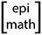

```{js navlink}
//This code is the JQuery that adds quality-of-life-improvement navigation links (click the title or logo to be redirected to the homepage) to the nav bar. The original elements that RMarkdown creates are basic <span> elements and they don't process hrefs (links) as well as <a> (anchor) elements do.

  $(document).ready( function(){
    //When the document is ready (aka it has finished loading), do the following:
      
      // Make the navbar-header a flex element whose child elements will be vertically centered and horizontally aligned to the start of the div//
      
      //$(".navbar-header").attr("style", "display: flex; align-items: center; justify-content: center; vertical-align: middle;")
      
      // Replace the existing "navbar-brand" element with an anchor element that allows users to click on the title, "Michigan COVID-19 Mapping" and be redirected to the homepage//
      
      $(".navbar-brand").replaceWith("<a class='navbar-brand' href= 'index.html'>Michigan COVID-19 Mapping</a>")
      
      //Replace the existing "navbar-logo" element with an image that has been styled to be vertically centered as well as padded, then wrap that image in an anchor element that allows users to click on the image to be redirected to the homepage//
      
      $(".navbar-logo").replaceWith("<div class='navbar-logo pull-left' ><a href='index.html'></a></div>")

    } // close the function that is run when the document is ready
  ) //close the document on ready function
```

```{r setup, include=FALSE}

library(ggplot2)
library(plotly)
library(plyr)
library(readr)
library(deSolve)
library(flexdashboard)
library (shiny)

load('Workspace2020-04-25-1587832621.RData')

# Convert times to date format for convenience
dates = startdate + ftimes
casedates = startdate + times

lastdate = tail(casedates,1)

# Turn off scientific notation on all axes (set scipen to 0 to enable scientific notation)
options(scipen=999)

# Convert dates from ggplot numeric to plotly numeric
dt = function(dates){as.numeric(as.POSIXct(dates))*1000}
```


```{r calcs, echo=FALSE,warning=FALSE,message=FALSE,error=FALSE }

#Calculate bounds
index= likesample<quantile(likesample,0.95)
ymin = apply(yobsincsample[,index], 1, min)
ymax = apply(yobsincsample[,index], 1, max)
ymed = apply(yobsincsample[,index], 1, median)
deathmin = apply(yobsdeathsample[,index], 1, min)
deathmax = apply(yobsdeathsample[,index], 1, max)
deathmed = apply(yobsdeathsample[,index], 1, median)
ICUmin = apply(ycurrICUsample[,index], 1, min)
ICUmax = apply(ycurrICUsample[,index], 1, max)
ICUmed = apply(ycurrICUsample[,index], 1, median)
O2min = apply(ycurrO2sample[,index], 1, min)
O2max = apply(ycurrO2sample[,index], 1, max)
O2med = apply(ycurrO2sample[,index], 1, median)
patmin = apply(ycurrpatsample[,index], 1, min)
patmax = apply(ycurrpatsample[,index], 1, max)
patmed = apply(ycurrpatsample[,index], 1, median)
ventmin = apply(ycurrventsample[,index], 1, min)
ventmax = apply(ycurrventsample[,index], 1, max)
ventmed = apply(ycurrventsample[,index], 1, median)

#Something seems off about this line, at least when I check it, the browser says there's an issue at tx0
xestlh = ode(x0(paramestslh), ftimes, CoVode, paramestslh)

```

```{r tablefunctions}

# Calling this function at the end of each Explorables page (minus social distancing) brings up the forecast table displayed under "Current Summary"

make_table <- function(){
  forecasttable = c()
  forecasttable = rbind(forecasttable,
                        c(paste(format(lastdate+7, "%B %e"),'(1 week)'),
                        format(round_any(ymin[(lastdate + 7) - startdate + 1],1), scientific=F),
                        format(round_any(yobscumcarefun(xestlh,paramestslh)[(lastdate + 7) - startdate + 1],1), scientific=F),
  
                        format(round_any(ymax[(lastdate + 7) - startdate + 1],1), scientific=F) ) )
  forecasttable = rbind(forecasttable,
                        c(paste(format(lastdate+21, "%B %e"),'(3 weeks)'),
                        format(round_any(ymin[(lastdate + 21) - startdate + 1],1), scientific=F),
                        format(round_any(yobscumcarefun(xestlh,paramestslh)[(lastdate + 21) - startdate + 1],1), scientific=F),
  
                        format(round_any(ymax[(lastdate + 21) - startdate + 1],1), scientific=F) ) )
  forecasttable = as.data.frame(forecasttable)
  
  colnames(forecasttable) = c("Date", "Uncertainty lower bound", "Best-fit", "Uncertainty upper bound")
  knitr::kable(forecasttable)
}

```

Recent Updates {data-orientation=rows data-navmenu="Modeling Reports"}
=====================================
Row
-----------------------------------------------------------------------
### [Model 1](#scenario-1)

*an image preview here*
and a description here

Row
-----------------------------------------------------------------------
### [Model 2](#scenario-2)
*an image preview here*
and a description here


Scenario 1 {data-orientation=rows data-navmenu="Modeling Reports"}
=====================================
Row
-----------------------------------------------------------------------
### About
A short description about this scenario


*This is a placeholder page*

Scenario 2 {data-orientation=rows data-navmenu="Modeling Reports"}
=====================================
Row
-----------------------------------------------------------------------
### About
A short description about this scenario

*This is a placeholder page*


Social Distancing Scenarios {data-navmenu="Explorables" data-orientation=rows} 
===================================== 


Row {data-height=700}
-----------------------------------------------------------------------


### Social Distancing Scenarios

```{r}
# I really want to do something like below for the rest of the models
```

<iframe id="socialdistancing" src="https://sph-umich.shinyapps.io/covid-19-scenarios/" style="border: none; width: 100%; height: 100%" frameborder="0"></iframe>


Row {data-height=350}
-----------------------------------------------------------------------

### Summary

- Early in the growth phase, social distancing efforts tend to delay the epidemic peak further, while efforts later in the growth phase nearer the peak tend to reduce the epidemic peak more. 

- *Start efforts before the peak of the epidemic*: social distancing is generally more effective when it is started during the growth phase of the epidemic---once the peak has already occurred the impact of social distancing is often much less.

- *Continue efforts until after the peak of the epidemic*: to avoid a rebound in cases after social distancing efforts stop, social distancing efforts tend to work best if they continue past the peak of the epidemic. This means it will be important to consider how to make social distancing efforts sustainable.

<!-- - A marathon not a sprint: for the same total contact reduction (i.e. amount reduced $\times$ duration of social distancing), longer social distancing efforts can sometimes reduce the peak more effectively than shorter, harder-hitting social distancing efforts. This one's harder to explain and requires some fiddling, plus depending on the timing of the short term effort it can be not true... make an example and put that in there instead. -->


### Limitations


- While in the growth phase of the epidemic, projecting the height and timing of the peak or overall duration of the epidemic is highly uncertain. Thus, these simulations should be used to explore potential scenarios and general patterns regarding the impact of social distancing, rather than for prediction of specific numbers.

- This model represents just one simulation from the range of realistic parameter values used for forecasting (given in the 'About' tab). 

- This model does not account for stochasticity, i.e. the effects of randomness in contact patterns and the disease transmission process. This means that the model will not be able to capture the potential for random extinction of the epidemic during long periods with very few cases.


Publications {data-orientation=rows}
=====================================
Row
-----------------------------------------------------------------------
### Publications

- One
- Two
- Three
- Etc.

*This is a placeholder page*


About 
===================================== 

Column
-----------------------------------------------------------------------

Model description is in-progress, to be updated soon!

### Overview

This transmission model has been developed to assist in understanding and forecasting epidemic spread and hospital resource needs, and to explore and examine alternative scenarios (see scenarios tab). The model is calibrated based on Michigan data on COVID-19 testing and demographics, as well as Michigan and other literature data on disease progression, severity, mortality, etc. 
<br>

### Model description

<div style="float: right; padding: 15px; width: 450px; font-size:10pt;"><br>Figure 1. Diagram for the basic transmission model used in this analysis.</div>
<!-- {#id .class width=50% height=50%} -->

The spread of infectious disease in a population can be modeled as a dynamical system, where the number of infections changes over time accordingly to a host of complex and interrelated processes.  The two fundamental disease processes are transmission and recovery, but sociobehavioral processes or other aspects of the natural history of infection can also be included to model a specific disease outbreak.

We have tested several different models based on more complex versions of what is known as an SIR model, or susceptible (S), infectious (I), recovered (R) model. This class of models tracks the fraction of the population in different disease stages. 

A diagram of the simplest form of our model is shown in Figure 1. In this model of COVID19 disease, we track people who are susceptible ($S$), have mild disease but have not sought care ($I_1$), have mild disease and have sought care ($I_{1,c}$), have recovered ($R$), have severe disease ($I_2$), have been hospitalized ($H$), and have died ($D$). We have also tested similar models accounting for superspreading, alternative distributions of the latent and infectious period, and asymptomatic transmission, with similar results, so we opted for the simplest version of the model in this analysis. From the model, we estimated the number of people who need intensive care, ventilators, or oxygen support as a fraction of hospitalized patients. 

### Uncertainty and limitations

(In progress---more details to be added soon.)

Current Model Limitations

- **Tested fraction of cases**: For any disease, most surveillence data detects only a fraction of the true total cases. For this outbreak, this fraction is changing over time as testing capacity ramps up. For now, we are estimating an average fraction of cases reported. Our predictions will be highly uncertain early in the outbreak before testing capacity and the reporting fraction stabilize.

- **Prediction during the exponential growth phase of an epidemic**: It is notoriously difficult to predict important quantities such as the time or size of the peak number of cases while early on in an outbreak---or even just to forecast more than a couple weeks ahead with any accuracy. For example, we won't know how much social distancing is impacting transmission rates until we start to see a change in the trajectory of cases (which, given the ramp up in testing and relatively long incubation period for this disease, may take days up to a couple of weeks after social distancing changes happen). 

<!-- Additional model assumptions and limitations discussion to add -->

<!-- - Current limitations that will be addressed by coming changes to the model (e.g. fitting to daily incidence rather than cumulative, etc.) -->
<!-- - Limitations that will improve with more data  -->
<!-- - General limitations that (at least for now...) are sort of built in -->
<!-- - Data sources -->
<!-- - Model validation - figures for testing our forecasts against previous data here -->


### Parameter estimation

COVID19 disease is caused by the novel coronavirus SARS-Cov-2. Because it is so new, there is a lot of uncertainty about the natural history of the virus---how long the incubation period is, what the mortality rate is for different age groups, etc. This uncertainty surrounds almost every parameter in our model, and these parameters cannot be estimated from the epidemic curve alone (particularly early in the epidemic when few parameters are needed to replicate the epidemic growth rate).

Because we can make reasonable guesses as to sensible bounds for each parameter, we can take hundreds and thousands of combinations of reasonable values of the model parameters (currently, we use [Sobol sampling](https://arxiv.org/abs/1505.02350)). For each of these combination of parameters, we estimate the value of the reporting rates for cases and deaths that best explain the trajectory of the data. Altogether, these thousands of trajectories represent our best guess as to what the true epidemic curve has been---and what it will be shortly. 


### Parameter values and ranges for sampling
(To be updated with sources)
```{r table}
paramtable = P[c(1,4:23,25),c(1:4,6,7)]
# paramtable[1,5] = "Total population of Michigan"
# paramtable[2,5] = "Fraction of symptomatic individuals who are laboratory-confirmed"
# paramtable[7,5] = "Mortality fraction among infected individuals"
knitr::kable(paramtable)
```


Team
========================================================================================

Column
-----------------------------------------------------------------------

### The Team
The University of Michigan Epimath COVID-19 Modeling group is comprised of:

- Andrew Brouwer, PhD - Department of Epidemiology, University of Michigan
- Sandro Cinti, MD - Department of Internal Medicine, University of Michigan Medical School
- Jeremy D'Silva, Department of Mathematics, University of Michigan
- Peter DeJonge, Department of Epidemiology, University of Michigan
- Marisa Eisenberg, PhD - Departments of Epidemiology and Complex Systems, University of Michigan
- Emily Martin, PhD, MPH - Department of Epidemiology, University of Michigan
- Josh Petrie, PhD, MPH - Department of Epidemiology, University of Michigan
- Marissa Renardy, PhD - Department of Microbiology and Immunology, University of Michigan

Questions? Please contact Marisa Eisenberg (marisae@umich.edu), Andrew Brouwer (brouweaf@umich.edu), and Josh Petrie (jpetrie@umich.edu) for more information.
